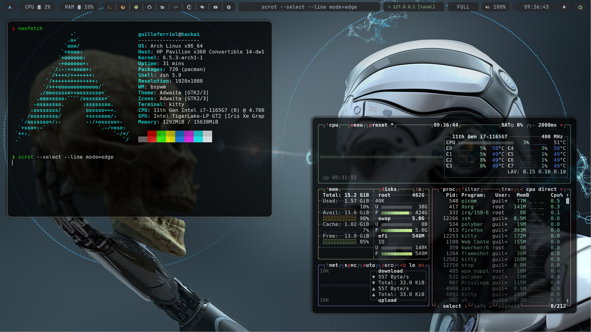

# arch-dotfiles
 
### My current system configuration on Arch Linux

| [OS](# "Operative System")           | [WM](# "Window Manager")                      | Bar                                           | Compositor                                 |
| ------------------------------------ | --------------------------------------------- | --------------------------------------------- | ------------------------------------------ |
| [Arch Linux](https://archlinux.org/) | [bspwm](https://github.com/baskerville/bspwm) | [Polybar](https://github.com/polybar/polybar) | [Picom](https://github.com/ibhagwan/picom) |

| Terminal                            | Shell                       | Font                                                  |
| ----------------------------------- | --------------------------- | ----------------------------------------------------- |
| [Kitty](https://sw.kovidgoyal.net/kitty/) | [Zsh](https://www.zsh.org/) | [JetBrainsMono Nerd Font](https://www.nerdfonts.com/) |

- [Installation](./installation.md)
- [Packages](./package.md)

### Desktop

